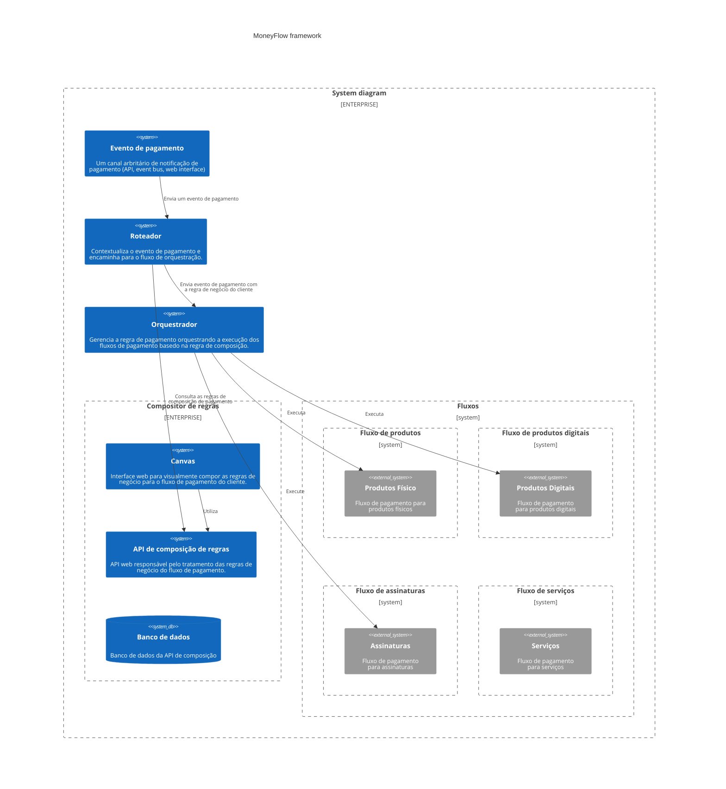
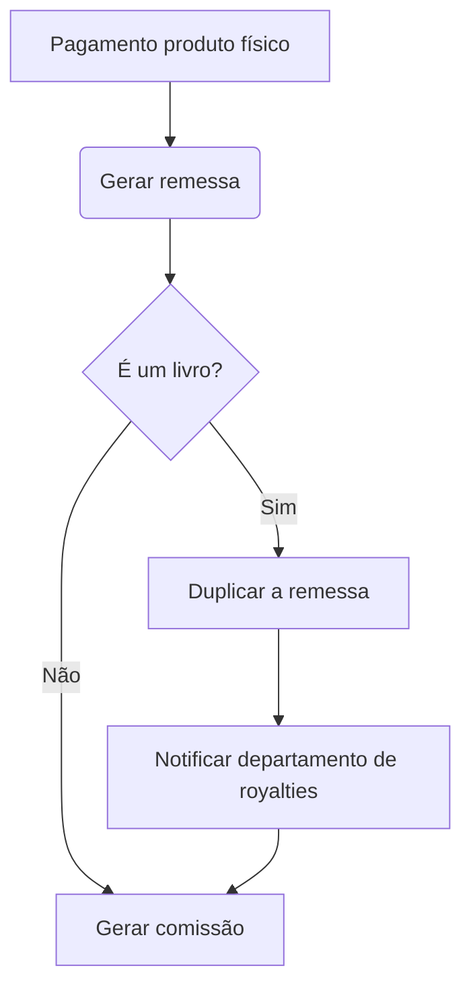

- [MoneyFlow](#moneyflow)
  - [Características principais](#características-principais)
  - [Arquitetura](#arquitetura)
  - [Design](#design)

## MoneyFlow

MoneyFlow é um framework de fluxo de pagamentos que permite vocês compor as regras de negócio para qualquer cenário de pagamento!

### Características principais

**Flexibilidade**
O sistem precisa atender de forma flexível as regras de negócio que mudam com frequência.

**Manutenibilidade**
O sistema precisa ser de fácil manutenção, para que as mudanças sejam feitas de forma rápida e segura. A necessidade de frequentemente adaptar o sistema com novas regras de negócio não pode afetar de forma negativa o crescimento e manutenção da base de código.

**Escalabilidade**
Escalabilidade operacional e sistêmica precisam andar lado a lado com a evolução do sistema. Atender o progresso de novas funcionalidades e suportar o crescimento da equipe são questões importantes para o projeto.

### Arquitetura

### Design

O design do projeto é baseado na idealização de um framework de pagamento. A ideia central do framework é propopr uma interface comum para um fluxo arbritário de pagamento, onde o negócio pode compor as regras de acordo com a necessidade do cliente.

O framework propoe alguns atores como coadjuvenvantes para o funcionamento do fluxo de pagamento. São eles:

**Compositor de regras**
Responsável por compor as regras de negócio para o fluxo de pagamento do cliente. O compositor é uma interface web que permite a visualização e edição das regras de negócio. A interface é composta por um canvas onde o usuário pode arrastar e soltar os componentes de regras de negócio para compor o fluxo de pagamento. O compositor é responsável por persistir as regras de negócio no banco de dados.

A interface deve seguir um modelo de componentes no estilo fluxograma, onde cada componente representa uma regra de negócio, cada componente pode ser conectado a outros componentes para compor o fluxo de pagamento definindo as interações entre os componentes.

Exemplo:

- O sistema de componentes deve seguir um fluxo aciclíco, onde o fluxo de pagamento é definido por uma sequência de componentes que se conectam entre si.
- O sistema de componentes deve permitir dependências entre componentes, onde um componente pode depender de outro componente para ser executado.
- O sistema de componentes deve ser tolerante a falhas, onde um componente pode falhar e o fluxo de pagamento deve ser capaz de se recuperar da falha e continuar a execução do fluxo de pagamento.

**Roteador**
Dado uma entrada de pagamento e composição do cliente para o pagamento do contexto recebido o roteador é responsável por encaminhar o evento de pagamento para o fluxo de pagamento adicionando o contexto do cliente e a regra de negócio para o pagamento em especifico.

**Orquestrador**
O orquestrador é a camada responsável por garantir a correta composição da regra de negócio do cliente. Conectando os fluxos e fazendo o acompanhando da execução. Pense no orquestrador como um maestro de uma orquestra, onde cada fluxo é um instrumento e o maestro é responsável por garantir que cada instrumento seja tocado na ordem correta e no momento certo.

- O orquestrador deve ser capaz de executar os fluxos de pagamento em paralelo.
- O orquestrador deve ser capaz de executar e lidar com falhas de execuçãos nos fluxos.
- O orquestrador deve ser capaz de entender as dependências entre os componentes dos fluxos e garantir a execução na ordem correta.
- O orquestrador deve ser capaz de monitorar e notificar o estado de execução dos fluxos.

**Fluxos**
Os fluxos são a parte operacional do framework onde os componentes são executados. Cada fluxo é responsável por garantir a correta execução dos componentes que compoem a regra de negócio do cliente. Tomando conta da ordem de execução, dependências, falhas e comunicação entre os componentes.

- Os fluxos devem ser capazes de executar os componentes em sequência.
- Os fluxos devem ser capazes de executar e lidar com falhas de execução dos componentes.
- Os fluxos devem ser idempotentes, se executados multiplas vezes devem produzir o mesmo resultado.
- Os fluxos devem ser resilientes a falhas, se um componente falhar o fluxo deve ser capaz de se recuperar e continuar a execução dadas as diretrizes de falha para o componente.
- Os componentes dos fluxos deve seguir uma mesma interface de execução, onde cada componente deve receber uma entrada e produzir uma saída.
