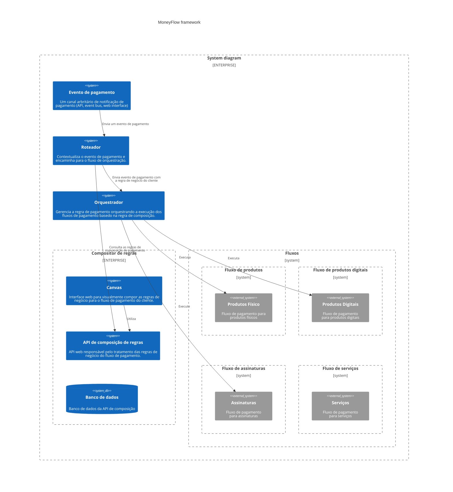
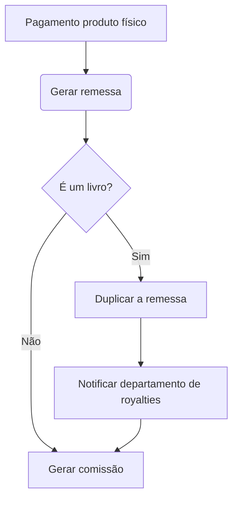
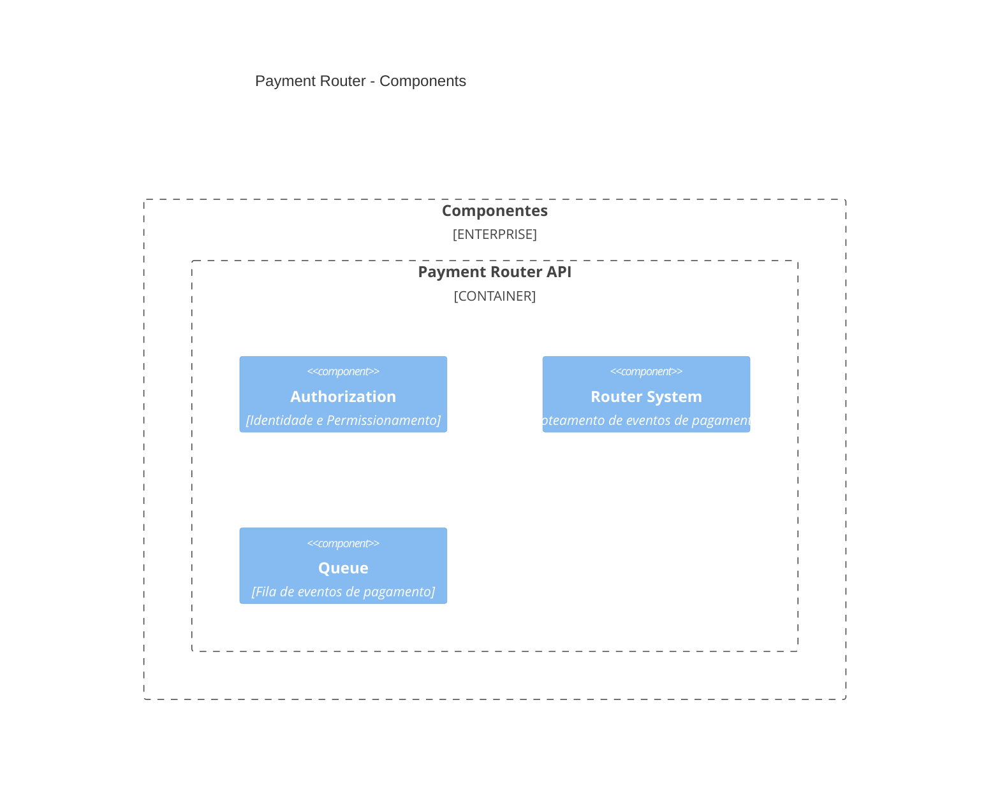
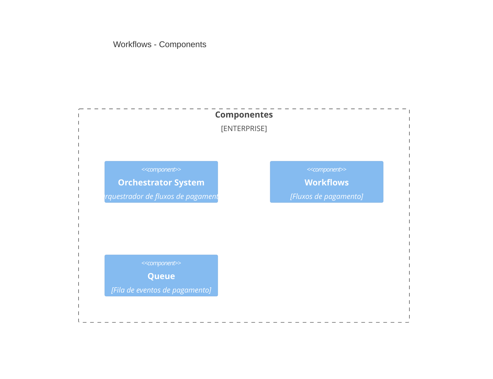
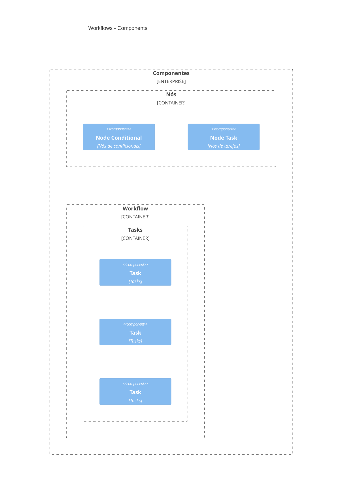
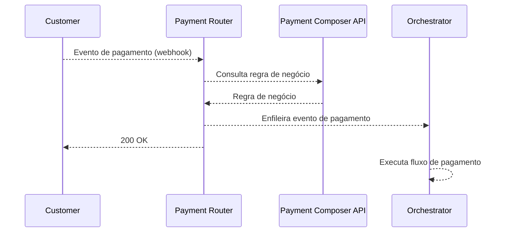

## MoneyFlow (Alpha version)

[](https://github.com/morais90/moneyflow/actions/workflows/pre-commit.yml) [](https://github.com/morais90/moneyflow/actions/workflows/tests.yml)

MoneyFlow é um framework de fluxo de pagamentos que permite compor as regras de negócio para qualquer cenário de pagamento!


- [MoneyFlow (Alpha version)](#moneyflow-alpha-version)
  - [Características arquiteturais](#características-arquiteturais)
  - [Arquitetura](#arquitetura)
  - [Design](#design)
  - [Requerimentos](#requerimentos)
  - [Rodando o projeto](#rodando-o-projeto)
  - [Parando os serviços](#parando-os-serviços)
  - [Rodando migrations iniciais (payment-composer-api)](#rodando-migrations-iniciais-payment-composer-api)
  - [Gerando migrations (payment-composer-api)](#gerando-migrations-payment-composer-api)
  - [Rodando tests (payment-composer-api)](#rodando-tests-payment-composer-api)
  - [Entendendo e testando o fluxo de pagamento](#entendendo-e-testando-o-fluxo-de-pagamento)
    - [Crie uma regra de negócio no Payment Composer API](#crie-uma-regra-de-negócio-no-payment-composer-api)
    - [Simule um evento através do webhook](#simule-um-evento-através-do-webhook)

### Características arquiteturais

MoneyFlow foi desenhado como um sistema distribuído considerando as seguintes características arquiteturais:

**Flexibilidade**

Entendemos que as regras de negócio para o fluxo de pagamento mudam com frequência, por isso, MoneyFlow é flexível para se adaptar às mudanças.

**Manutenibilidade**

Mudanças não podem ser dolorosas de serem feitas, elas precisam ser ágeis e fáceis. MoneyFlow foi desenhado de uma forma modular para que o acoplamento de código não torne a manutenção do sistema um pesadelo.

**Escalabilidade**

Escalabilidade operacional e sistêmica precisam andar lado a lado com a evolução do projeto. Atender o progresso de novas funcionalidades e suportar o crescimento da equipe são quesitos levantados pelo design do sistema, aplicando modularidade em conjunto com sistema distribuído.

### Arquitetura



### Design

O design do projeto é baseado na idealização de um framework de pagamento. A ideia central do framework é propor uma interface comum para um fluxo arbritário de pagamento, onde o negócio pode compor as regras de acordo com a necessidade do cliente.

O framework propõe alguns atores como coadjuvantes para o funcionamento do fluxo de pagamento.

**Compositor de regras**

Responsável por compor as regras de negócio para o fluxo de pagamento do cliente, o compositor é uma interface web que permite a visualização e edição das regras de negócio por meio de um canvas onde o usuário pode arrastar e soltar os componentes de regras de negócio para compor o fluxo de pagamento.

A interface segue um modelo de componentização baseado em fluxograma, onde cada componente representa um nó na regra de negócio cada um pondendo ser conectado a a outro para compor o fluxo de pagamento definindo as interações.

Exemplo:



- O sistema de componentes deve seguir um fluxo aciclíco, onde o fluxo de pagamento é definido por uma sequência de componentes que se conectam entre si.
- O sistema de componentes deve permitir dependências entre componentes, onde um componente pode depender de outro componente para ser executado.
- O sistema de componentes deve ser tolerante a falhas, onde um componente pode falhar e o fluxo de pagamento deve ser capaz de se recuperar da falha e continuar a execução do fluxo de pagamento.


**Roteador**

O roteador é responsável por encaminhar o evento de pagamento para o fluxo de pagamento do cliente, contextualizando o evento de pagamento com a regra de negócio.



**Orquestrador**

O orquestrador é a camada responsável por garantir a correta composição da regra de negócio do cliente, conectando os fluxos e fazendo o acompanhando da execução. Pense no orquestrador como um maestro de uma orquestra, onde cada fluxo é um instrumento e o maestro é responsável por garantir que cada instrumento seja tocado na ordem correta e no momento certo.

- O orquestrador deve ser capaz de executar os fluxos de pagamento em paralelo.
- O orquestrador deve ser capaz de executar e lidar com falhas de execução nos fluxos.
- O orquestrador deve ser capaz de entender as dependências entre os componentes dos fluxos e garantir a execução na ordem correta.
- O orquestrador deve ser capaz de monitorar e notificar o estado de execução dos fluxos.



**Fluxos**

Os fluxos são a parte operacional do framework onde os componentes são executados. Cada fluxo é responsável por garantir a correta execução dos componentes que compõem a regra de negócio do cliente, tomando conta da ordem de execução, dependências, falhas e comunicação entre os componentes.

- Os fluxos devem ser capazes de executar os componentes em sequência.
- Os fluxos devem ser capazes de executar e lidar com falhas de execução dos componentes.
- Os fluxos devem ser idempotentes, se executados múltiplas vezes devem produzir o mesmo resultado.
- Os fluxos devem ser resilientes a falhas. Se um componente falhar, o fluxo deve ser capaz de se recuperar e continuar a execução dadas as diretrizes de falha para o componente.
- Os componentes dos fluxos deve seguir uma mesma interface de execução, onde cada componente deve receber uma entrada e produzir uma saída.



### Requerimentos

- [Docker](https://docs.docker.com/get-docker/)
- [Docker Compose](https://docs.docker.com/compose/install/)
- [pre-commit](https://pre-commit.com/#install)

### Rodando o projeto

```shell
$ docker compose up
```

Após iniciar os serviços, você terá disponível os seguintes acessos:

| Serviço              | Acesso                                              |
| -------------------- | --------------------------------------------------- |
| Postgres             | localhost:5432                                      |
| RabbitMQ             | localhost:5672, http://localhost:15672 (Management) |
| Payment Composer API | http://localhost:8000/docs                          |
| Payment Composer UI  | http://localhost:5173                               |
| Payment Router       | http://localhost:8001/docs                          |
| Orchestrator         | Somente worker                                      |

### Parando os serviços

```shell
$ docker compose stop
```

Para parar os serviços e remover os volumes, é necessário executar o seguinte comando:

```shell
$ docker compose down -v
```

:warning: **Atenção**: este comando irá remover todos os volumes dos serviços, incluindo o banco de dados e o RabbitMQ. Tenha certeza que você deseja remover os volumes antes de executar este comando.

### Rodando migrations iniciais (payment-composer-api)

```shell
$ docker compose run --rm payment-composer-api alembic upgrade head
```

### Gerando migrations (payment-composer-api)

```shell
$ docker compose run --rm payment-composer-api alembic revision --autogenerate
```

### Rodando tests (payment-composer-api)

```shell
$ docker compose run --rm payment-composer-api pytest -s -vv
```

### Entendendo e testando o fluxo de pagamento



#### Crie uma regra de negócio no Payment Composer API

`POST` http://localhost:8000/payment-rules

```json
{
  "company_id": "b5aa9687-d61f-467c-973e-f55d446981dc",
  "rules": [
    {
      "node_type": "condition",
      "node_id": "condition-1",
      "expect": [
        {
          "field": "$context.event.payment_type",
          "operator": "eq",
          "value": ["product"]
        }
      ]
    },
    {
      "node_type": "task",
      "node_id": "abort-flow-1",
      "depends_on": [
        {
          "node_id": "conditional-1",
          "state": "failure"
        }
      ],
      "task_name": "payment.tasks.abort_flow",
      "parameters": null
    },
    {
      "node_type": "task",
      "node_id": "generate-invoice-1",
      "depends_on": [
        {
          "node_id": "conditional-1",
          "state": "success"
        }
      ],
      "task_name": "payment.tasks.generate_invoice",
      "parameters": {
        "company_id": "$context.event.company_id",
        "product_id": "$context.event.product.id"
      }
    },
    {
      "node_type": "condition",
      "node_id": "condition-2",
      "depends_on": [
        {
          "node_id": "condition-1",
          "state": "success"
        }
      ],
      "expect": [
        {
          "field": "$context.event.product.type",
          "operator": "in",
          "value": ["book", "ebook"]
        }
      ]
    },
    {
      "node_type": "task",
      "node_id": "generate_royalty-1",
      "task_name": "payment.tasks.generate_royalty",
      "parameters": {
        "company_id": "$context.event.company_id",
        "product_id": "$context.event.product.id"
      }
    }
  ]
}
```

#### Simule um evento através do webhook

`POST` http://localhost:8001/payment

```json
{
  "company_id": "b5aa9687-d61f-467c-973e-f55d446981dc",
  "type": "product",
  "total": "120.0"
}
```
